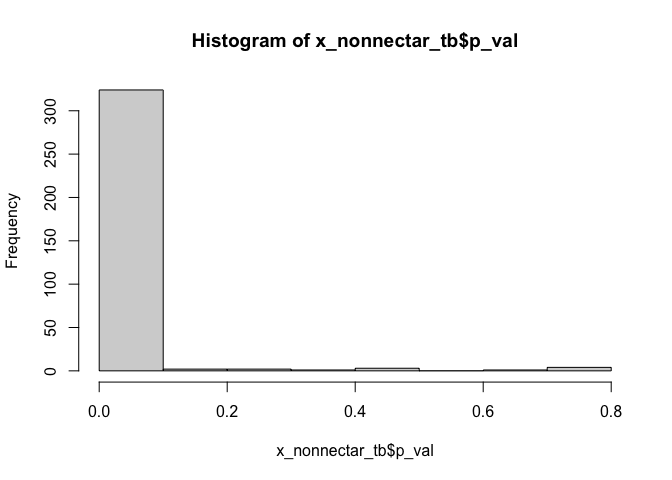

multimonial
================
maggie
2022-11-05

### all cnees within 100kb of a gene

``` r
set.seed(100)
library(tidyverse) 
```

    ## ── Attaching packages ─────────────────────────────────────── tidyverse 1.3.2 ──
    ## ✔ ggplot2 3.3.6      ✔ purrr   0.3.5 
    ## ✔ tibble  3.1.8      ✔ dplyr   1.0.10
    ## ✔ tidyr   1.2.1      ✔ stringr 1.4.1 
    ## ✔ readr   2.1.3      ✔ forcats 0.5.2 
    ## ── Conflicts ────────────────────────────────────────── tidyverse_conflicts() ──
    ## ✖ dplyr::filter() masks stats::filter()
    ## ✖ dplyr::lag()    masks stats::lag()

``` r
library(ggvenn)
```

    ## Loading required package: grid

``` r
project_path = paste0(getwd(), "/postPhyloAcc/")
out_path = paste0(project_path, "convergentLv/")

## all cnees within 100kb of a gene (created using bedtools)
path = paste0(project_path, "linear/cnee_ncbigene100kb_intersect_allcnees.bed")
allcnees = read_tsv(path, col_names = F) %>% 
  filter(X6 == "protein_coding") %>%
  dplyr::select(X4, X5, X10) %>%
  dplyr::rename("gene" = "X4", "id" = "X10", "combo" = "X5") %>%
  separate(combo, into = c(NA, "ncbi"), sep = "GeneID:", remove = F) %>% 
  dplyr::select(gene, id) 
```

    ## Rows: 992273 Columns: 10
    ## ── Column specification ────────────────────────────────────────────────────────
    ## Delimiter: "\t"
    ## chr (6): X1, X4, X5, X6, X7, X10
    ## dbl (4): X2, X3, X8, X9
    ## 
    ## ℹ Use `spec()` to retrieve the full column specification for this data.
    ## ℹ Specify the column types or set `show_col_types = FALSE` to quiet this message.

``` r
dim(allcnees) # 613780      2
```

    ## [1] 613780      2

``` r
head(allcnees)
```

    ## # A tibble: 6 × 2
    ##   gene      id   
    ##   <chr>     <chr>
    ## 1 LOC430443 CNEE3
    ## 2 LOC430443 CNEE4
    ## 3 LOC430443 CNEE5
    ## 4 GOLGB1    CNEE3
    ## 5 GOLGB1    CNEE4
    ## 6 GOLGB1    CNEE5

``` r
# gene      id   
# <chr>     <chr>
# 1 LOC430443 CNEE3
```

### kegg annotation

``` r
## custom kegg annotation
path = paste0(project_path, "ncbi_anno_kegg_hsa_2022-10-22.tsv")
custom_anno = read_tsv(path)
```

    ## Rows: 17340 Columns: 7
    ## ── Column specification ────────────────────────────────────────────────────────
    ## Delimiter: "\t"
    ## chr (5): gene, ensembl_gene_id, hsapiens_homolog_ensembl_gene, pathway_hsa, ...
    ## dbl (2): entrezgene_id_gal, entrez_hsa
    ## 
    ## ℹ Use `spec()` to retrieve the full column specification for this data.
    ## ℹ Specify the column types or set `show_col_types = FALSE` to quiet this message.

``` r
custom_anno_allcnees = custom_anno %>% left_join(allcnees) %>% 
  distinct()
```

    ## Joining, by = "gene"

``` r
dim(custom_anno_allcnees) # 819389      8
```

    ## [1] 819389      8

``` r
head(custom_anno_allcnees)
```

    ## # A tibble: 6 × 8
    ##   gene      entrezgene_id_gal ensembl_ge…¹ hsapi…² entre…³ pathw…⁴ descr…⁵ id   
    ##   <chr>                 <dbl> <chr>        <chr>     <dbl> <chr>   <chr>   <chr>
    ## 1 LAMTOR1           100857186 ENSGALG0000… ENSG00…   55004 path:h… mTOR s… CNEE…
    ## 2 LAMTOR1           100857186 ENSGALG0000… ENSG00…   55004 path:h… mTOR s… CNEE…
    ## 3 LAMTOR1           100857186 ENSGALG0000… ENSG00…   55004 path:h… mTOR s… CNEE…
    ## 4 RAB11FIP3         100857269 ENSGALG0000… ENSG00…    9727 path:h… Endocy… CNEE…
    ## 5 RAB11FIP3         100857269 ENSGALG0000… ENSG00…    9727 path:h… Endocy… CNEE…
    ## 6 RAB11FIP3         100857269 ENSGALG0000… ENSG00…    9727 path:h… Endocy… CNEE…
    ## # … with abbreviated variable names ¹​ensembl_gene_id,
    ## #   ²​hsapiens_homolog_ensembl_gene, ³​entrez_hsa, ⁴​pathway_hsa, ⁵​description_hsa

``` r
## kegg pathway id and description
custom_anno_id = custom_anno %>% 
  dplyr::select(pathway_hsa, description_hsa) %>% distinct()
head(custom_anno_id)
```

    ## # A tibble: 6 × 2
    ##   pathway_hsa   description_hsa                      
    ##   <chr>         <chr>                                
    ## 1 path:hsa04150 mTOR signaling pathway               
    ## 2 path:hsa04144 Endocytosis                          
    ## 3 path:hsa04070 Phosphatidylinositol signaling system
    ## 4 path:hsa04110 Cell cycle                           
    ## 5 path:hsa04114 Oocyte meiosis                       
    ## 6 path:hsa04120 Ubiquitin mediated proteolysis

``` r
## total cnees of a kegg pathway
custom_anno_allcnees_sum = custom_anno_allcnees %>% 
  group_by(pathway_hsa) %>% 
  summarise(total_cnees = length(unique(id)))
dim(custom_anno_allcnees_sum) # 350 2
```

    ## [1] 350   2

``` r
head(custom_anno_allcnees_sum)
```

    ## # A tibble: 6 × 2
    ##   pathway_hsa   total_cnees
    ##   <chr>               <int>
    ## 1 path:hsa00010         689
    ## 2 path:hsa00020         121
    ## 3 path:hsa00030         459
    ## 4 path:hsa00040         846
    ## 5 path:hsa00051         957
    ## 6 path:hsa00052         777

## nectar: pathway, gene, and acc cnees

``` r
## nectar: pathway, gene, and acc cnees 
path = paste0(out_path, "convergent_pathwayLv_full_2022-10-24.tsv")
pathway_acc_anno = read_tsv(path)
```

    ## Rows: 7338 Columns: 12
    ## ── Column specification ────────────────────────────────────────────────────────
    ## Delimiter: "\t"
    ## chr (7): group, gene, id, ensembl_gene_id, hsapiens_homolog_ensembl_gene, pa...
    ## dbl (5): ncbi, accel, total, entrezgene_id_gal, entrez_hsa
    ## 
    ## ℹ Use `spec()` to retrieve the full column specification for this data.
    ## ℹ Specify the column types or set `show_col_types = FALSE` to quiet this message.

``` r
## number of acc cnees for each pathway for each clade
pathway_acc_sum = pathway_acc_anno %>% group_by(pathway_hsa, description_hsa, group) %>% 
  summarise(total_acccnees = length(unique(id))) %>% 
  left_join(custom_anno_allcnees_sum)
```

    ## `summarise()` has grouped output by 'pathway_hsa', 'description_hsa'. You can
    ## override using the `.groups` argument.
    ## Joining, by = "pathway_hsa"

``` r
head(pathway_acc_sum)
```

    ## # A tibble: 6 × 5
    ## # Groups:   pathway_hsa, description_hsa [2]
    ##   pathway_hsa   description_hsa              group               total…¹ total…²
    ##   <chr>         <chr>                        <chr>                 <int>   <int>
    ## 1 path:hsa00010 Glycolysis / Gluconeogenesis honeyeaters               2     689
    ## 2 path:hsa00010 Glycolysis / Gluconeogenesis hummingbirds              7     689
    ## 3 path:hsa00010 Glycolysis / Gluconeogenesis parrots                   2     689
    ## 4 path:hsa00010 Glycolysis / Gluconeogenesis sunbirds_flowerpec…       1     689
    ## 5 path:hsa00030 Pentose phosphate pathway    hummingbirds              2     459
    ## 6 path:hsa00030 Pentose phosphate pathway    parrots                   1     459
    ## # … with abbreviated variable names ¹​total_acccnees, ²​total_cnees

## core non-nectar: pathway, gene, and acc cnees

``` r
## core non-nectar: pathway, gene, and acc cnees 
path = paste0(out_path, "convergent_pathwayLv_control_2022-11-05.tsv")
pathway_acc_anno_con = read_tsv(path)
```

    ## Rows: 17148 Columns: 12
    ## ── Column specification ────────────────────────────────────────────────────────
    ## Delimiter: "\t"
    ## chr (7): group, gene, id, ensembl_gene_id, hsapiens_homolog_ensembl_gene, pa...
    ## dbl (5): ncbi, accel, total, entrezgene_id_gal, entrez_hsa
    ## 
    ## ℹ Use `spec()` to retrieve the full column specification for this data.
    ## ℹ Specify the column types or set `show_col_types = FALSE` to quiet this message.

``` r
## number of acc cnees for each pathway for each clade
pathway_acc_con_sum = pathway_acc_anno_con %>% group_by(pathway_hsa, description_hsa, group) %>% 
  summarise(total_acccnees = length(unique(id))) %>% 
  left_join(custom_anno_allcnees_sum)
```

    ## `summarise()` has grouped output by 'pathway_hsa', 'description_hsa'. You can
    ## override using the `.groups` argument.
    ## Joining, by = "pathway_hsa"

``` r
head(pathway_acc_con_sum)
```

    ## # A tibble: 6 × 5
    ## # Groups:   pathway_hsa, description_hsa [2]
    ##   pathway_hsa   description_hsa              group      total_acccnees total_c…¹
    ##   <chr>         <chr>                        <chr>               <int>     <int>
    ## 1 path:hsa00010 Glycolysis / Gluconeogenesis falcons                 3       689
    ## 2 path:hsa00010 Glycolysis / Gluconeogenesis lyrebirds               4       689
    ## 3 path:hsa00010 Glycolysis / Gluconeogenesis passerides              3       689
    ## 4 path:hsa00010 Glycolysis / Gluconeogenesis swifts                  8       689
    ## 5 path:hsa00020 Citrate cycle (TCA cycle)    lyrebirds               1       121
    ## 6 path:hsa00020 Citrate cycle (TCA cycle)    passerides              1       121
    ## # … with abbreviated variable name ¹​total_cnees

### Multinomial Distribution

``` r
# num of total cnees 
t = 363747 
# num of cnees accelerated in any branch (logBF3 >=10)
# t = 61468 # same results


## probability
# nectar
hump = 1691/t
parp = 1125/t
honp = 523/t
sunp = 481/t

# non-nectar
p = 2418/t
l = 1591/t
f = 1863/t
s = 2310/t

# 100K random samples
nectar_md = rmultinom(100000, size = 4, prob = c(hump, parp, honp, sunp))
nonnectar_md = rmultinom(100000, size = 4, prob = c(p, l, f, s))
dim(nectar_md) # 4 100000
```

    ## [1]      4 100000

``` r
nectar_md[,1:4]
```

    ##      [,1] [,2] [,3] [,4]
    ## [1,]    1    0    3    2
    ## [2,]    2    2    1    2
    ## [3,]    0    1    0    0
    ## [4,]    1    1    0    0

### nectar

``` r
tmp_pathways = unique(pathway_acc_sum$pathway_hsa)
length(tmp_pathways) # 336
```

    ## [1] 336

``` r
sp_seq = c("hummingbirds", "parrots", "honeyeaters", "sunbirds_flowerpecker") # as rmultinom
x_nectar = sapply(tmp_pathways, function(s){
  # s = tmp_pathways[2]
  
  # for each pathway, get the number of acccnee for each clade
  tmp = pathway_acc_sum %>% filter(pathway_hsa == s)
  tmp_matrix = tmp[match(sp_seq, tmp$group), ] # sort clades (row) as rmultinom
  tmp_matrix_acc = tmp_matrix$total_acccnees
  tmp_matrix_acc[is.na(tmp_matrix_acc)] <- 0   # for clades without any acc. cnee, replace NA to 0
  
  # for each random sample (a col in nectar_md), 
  # check if the expected is greater than or equal to to the observed (num. acc. cnees) for each clade (row)
  ind <- ( nectar_md >= tmp_matrix_acc ) 
  sum_col = apply(ind, 2, sum) # sum up by col, 
  # if all 4 clades' expected is >= observed, the col will have a sum of 4
  r = sum(sum_col == 4) # sum up how many random samples have more greater than or equal to the observed
  return(r)
})

x_nectar_tb = x_nectar %>% as_tibble(rownames = "pathway_hsa") %>% 
  mutate(p_val = (value+1)/100001) %>%  #  (r+1)/(n+1)
  left_join(custom_anno_id) # %>% 
```

    ## Joining, by = "pathway_hsa"

``` r
  # filter(p_val<=0.01)
nrow(x_nectar_tb) # p_val<= 0.05: 296; p_val<= 0.01: 289
```

    ## [1] 336

``` r
hist(x_nectar_tb$p_val)
```

<!-- -->

### core non-nectar

``` r
tmp_pathways = unique(pathway_acc_con_sum$pathway_hsa)
length(tmp_pathways) # 337
```

    ## [1] 337

``` r
sp_seq = c("swifts", "falcons", "lyrebirds", "passerides")
x_nonnectar = sapply(tmp_pathways, function(s){
  # s = tmp_pathways[2]
  
  # for each pathway, get the number of acccnee for each clade
  tmp = pathway_acc_con_sum %>% filter(pathway_hsa == s)
  tmp_matrix = tmp[match(sp_seq, tmp$group), ] # sort clades (row) as rmultinom
  tmp_matrix_acc = tmp_matrix$total_acccnees
  tmp_matrix_acc[is.na(tmp_matrix_acc)] <- 0   # for clades without any acc. cnee, replace NA to 0
  
  # for each random sample (a col in nectar_md), 
  # check if the expected is greater than or equal to to the observed (num. acc. cnees) for each clade (row)
  ind <- ( nonnectar_md >= tmp_matrix_acc ) 
  sum_col = apply(ind, 2, sum) # sum up by col, 
  # if all 4 clades' expected is >= observed, the col will have a sum of 4
  r = sum(sum_col == 4) # sum up how many random samples have more greater than or equal to the observed
  return(r)
})

x_nonnectar_tb = x_nonnectar %>% as_tibble(rownames = "pathway_hsa") %>% 
  mutate(p_val = (value+1)/100001) %>%  #  (r+1)/(n+1)
  left_join(custom_anno_id) #%>% 
```

    ## Joining, by = "pathway_hsa"

``` r
  # filter(p_val<=0.01)
nrow(x_nonnectar_tb) # p_val<= 0.05: 320; p_val<= 0.01: 318 (after fdr is the same)
```

    ## [1] 337

``` r
hist(x_nonnectar_tb$p_val)
```

<!-- -->

``` r
ggvenn(list('nectar' = x_nectar_tb$pathway_hsa,
            'non-nectar' = x_nonnectar_tb$pathway_hsa))
```

<!-- -->

``` r
onlyInNect = x_nectar_tb %>% 
  filter(! pathway_hsa %in% x_nonnectar_tb$pathway_hsa ) 
onlyInNect
```

    ## # A tibble: 5 × 4
    ##   pathway_hsa   value  p_val description_hsa                                 
    ##   <chr>         <int>  <dbl> <chr>                                           
    ## 1 path:hsa00515  4036 0.0404 Mannose type O-glycan biosynthesis              
    ## 2 path:hsa00533 35638 0.356  Glycosaminoglycan biosynthesis - keratan sulfate
    ## 3 path:hsa00670 75214 0.752  One carbon pool by folate                       
    ## 4 path:hsa04672 10192 0.102  Intestinal immune network for IgA production    
    ## 5 path:hsa05320 75214 0.752  Autoimmune thyroid disease
